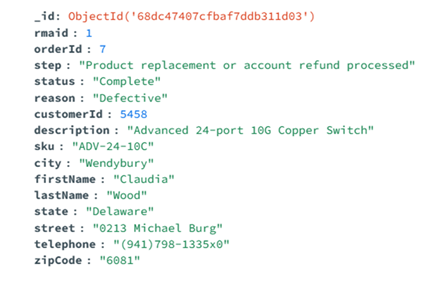
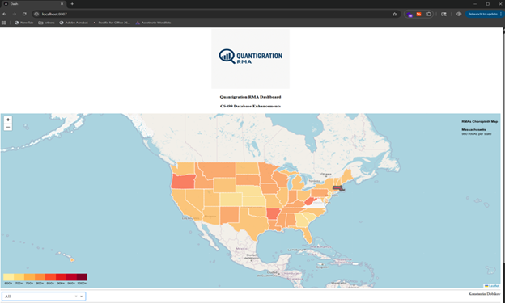
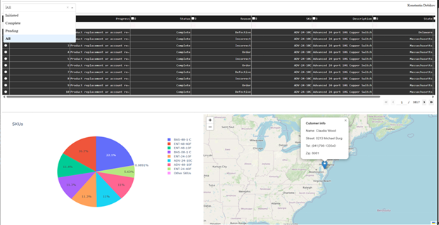

# Databases

During one of our previous courses at SNHU, DAD220 - Introduction to Structured Database Environments, we were tasked with creating a MySQL database schema, importing data, and analyzing it using multiple complex join queries across several tables to understand the reasons behind the company's low performance. 

I selected this artifact to demonstrate my ability to analyze data and present it to specific audiences, highlighting performance trends and areas for improvement. I utilized tools such as Python Dash for web dashboards and graphs, Leaflet for interactive maps, the Google Maps API to retrieve geolocation data for states, and Relational Migrator by MongoDB for migrating from a legacy relational database, MySQL, with multiple tables, to MongoDB, which has a single table. An example of a single document can be seen below:

<p align="center" width="100%"></p>

This approach simplified and sped up the analysis workflow while modernizing the application. I will also demonstrate my design and development skills by creating a well-structured web page by following the MVC design pattern. Screenshot of a web page can be seen below:

<p align="center" width="100%"></p>
<p align="center" width="100%"></p>

Below the logo, I placed the Choropleth Map to show which state has the most RMAs followed by a drop-down menu to access the table of results based on the RMA status, which corresponds to the pie chart below showing the affected SKUs and a map with a marker indicating the state, along with customer information as a pop-up layer of the selected item in the table. Additionally, the RmasCrudClass class was developed to add CRUD functionality for RMA orders. 

```python
...
# Create method C in CRUD
    def create(self, data):
        result = False
        if data is not None:
            try:
                answer = self.collection.insert_one(data)  # data should be dictionary
                result = answer.acknowledged
            except TypeError:
                print("Data parameter has to be a dictionary")
        else:
            raise Exception("Nothing to save, because data parameter is empty")
        return result

# Read method R in CRUD.
    def read(self, data):
        result = []
        if data is not None:
            try:
                result = list(self.collection.find(data))  # data should be dictionary
                # print(result)
            except TypeError:
                print("Data parameter has to be a dictionary")
        else:
            raise Exception("Nothing to read, because data parameter is empty")
        return result

# Update method U in CRUD.
    def update(self, data_filter, data_match):
        if ((data_filter is not None) and (data_match is not None)):
            try:
                result = self.collection.update_many(data_filter, data_match)  # data should be dictionary
            except TypeError:
                print("Data parameter has to be a dictionary")
        else:
            raise Exception("Nothing to update, because data parameter is empty")
        return result.modified_count

# Delete method D in CRUD.
    def delete(self, data):
        if data is not None:
            try:
                result = self.collection.delete_many(data)  # data should be dictionary
            except TypeError:
                print("Data parameter has to be a dictionary")
        else:
            raise Exception("Nothing to delete, because data parameter is empty")
        return result.deleted_count
        
# Extra aggregate method for future use.
    def agg(self, data):
        if data is not None:
            try:
                result = self.collection.aggregate(data)  # data should be dictionary
            except TypeError:
                print("Data parameter has to be a dictionary")
        else:
            raise Exception("Nothing to aggregate, because data parameter is empty")
        return result
...
```

By implementing my enhancements, I achieved both of my planned outcomes, demonstrating my ability to employ strategies for building collaborative environments that support diverse audiences in organizational decision-making within the field of computer science. Additionally, I can design, develop, and deliver professional-quality oral, written, and visual communications that are clear, technically accurate, and appropriately tailored to specific audiences and contexts.    

